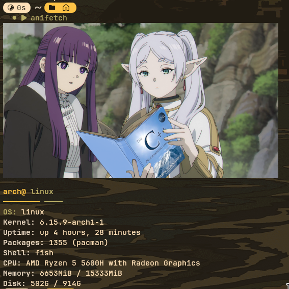

# AniFetch

A neofetch-like system information tool that displays anime girls holding programming books instead of the traditional OS logo.



*AniFetch displaying system information with a random anime girl holding programming books*

## Features

- Displays system information (OS, kernel, uptime, packages, shell, CPU, memory, disk)
- Fetches random anime girls from [Anime-Girls-Holding-Programming-Books](https://github.com/cat-milk/Anime-Girls-Holding-Programming-Books)
- **Dynamic terminal size detection** for optimal image display
- **High-quality rendering** with block symbols and 256 colors
- Caches images locally for faster runs
- Cross-platform support (Linux, macOS, Windows)

## Prerequisites

**Required:**
- Go 1.21 or later

**Highly Recommended (for best image quality):**
- chafa (terminal image viewer) - Without this, images will be blurry or show ASCII art

## Quick Start

### 1. Install Go (if not installed)

**Ubuntu/Debian:**
```bash
sudo apt update
sudo apt install golang-go
```

**Arch Linux:**
```bash
sudo pacman -S go
```

**macOS:**
```bash
brew install go
```

### 2. Install chafa (highly recommended for best quality)

```bash
sudo pacman -S chafa  # Arch
sudo apt install chafa # Ubuntu/Debian
brew install chafa     # macOS
```

**Note:** Without chafa, images will be blurry or show ASCII art instead.

**Important:** Use the latest version of chafa for best compatibility. Older versions may cause blurry images or errors.

### 3. Build and Install AniFetch

```bash
git clone https://github.com/robbsbro69/AniFetch.git
cd AniFetch
./install.sh
```

## Usage

```bash
# If installed globally (recommended)
anifetch                      # Run with image
anifetch --no-image          # Disable image display
anifetch --show-cache        # Show cached images
anifetch --clear-cache       # Clear cached images
anifetch --check-token       # Check GitHub token status
anifetch --size 15x8         # Small image (recommended)
anifetch --size 30x15        # Medium image
anifetch --size 60x30        # Large image

# If running locally
./anifetch                    # Run with image
./anifetch --no-image        # Disable image display
./anifetch --show-cache      # Show cached images
./anifetch --clear-cache     # Clear cached images
./anifetch --check-token     # Check GitHub token status
./anifetch --size 15x8       # Small image (recommended)
./anifetch --size 30x15      # Medium image
./anifetch --size 60x30      # Large image
```

## Updating AniFetch

When new features are added, update your installation:

```bash
# Update existing installation
cd ~/AniFetch
git pull origin main
go build -o anifetch main.go
sudo cp anifetch /usr/local/bin/

# OR fresh install
rm -rf ~/AniFetch
git clone https://github.com/robbsbro69/AniFetch.git
cd AniFetch
./install.sh
```

## GitHub Token (Optional)

For higher rate limits (5,000 vs 60 requests/hour):

```bash
export GITHUB_TOKEN="your_token_here"
```

## Troubleshooting

- **Images not showing?** Install `chafa` or try `--no-image`
- **Rate limit errors?** Set up GitHub token or use cached images
- **Image too big?** Use `--size 15x8` for smaller images
- **Image too small?** Use `--size 60x30` for larger images
- **Blurry images?** Make sure `chafa` is installed and updated to latest version
- **chafa errors?** Update to latest version: `sudo apt update && sudo apt install chafa`

## Acknowledgments

- **[Anime-Girls-Holding-Programming-Books](https://github.com/cat-milk/Anime-Girls-Holding-Programming-Books)** - Image source
- **[chafa](https://hpjansson.org/chafa/)** - Terminal image viewer
- **[neofetch](https://github.com/dylanaraps/neofetch)** - Inspiration

## License

[MIT License](LICENSE)
